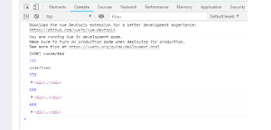

# Vue

## Vue.js 中 this.\$nextTick()的使用

this.\$nextTick()将回调延迟到下次 DOM 更新循环之后执行。在修改数据之后立即使用它，然后等待 DOM 更新。它跟全局方法 Vue.nextTick 一样，不同的是回调的 this 自动绑定到调用它的实例上。

假设我们更改了某个 dom 元素内部的文本，而这时候我们想直接打印出这个被改变后的文本是需要 dom 更新之后才会实现的，也就好比我们将打印输出的代码放在 setTimeout(fn, 0)中；

```bash

<template>

<section> 
<div ref="hello"> 
<h1>Hello World ~</h1> 
</div> 
<el-button type="danger" @click="get">点击</el-button> 
</section> 
</template> 
<script>
export default {
  mounted() {
    console.log(333);
    console.log(this.$refs["hello"]);
    his.$nextTick(() => {
      console.log(444);
      console.log(this.$refs["hello"]);
    });
  },
  created() {
    console.log(111);
    console.log(this.$refs["hello"]);
    this.$nextTick(() => {
      console.log(222);
      console.log(this.$refs["hello"]);
    });
  }
};

</script>
<template>

```


可以根据打印的顺序看到，在created()钩子函数执行的时候DOM 其实并未进行任何渲染，而此时进行DOM操作并无作用，而在created()里使用this.$nextTick()可以等待dom生成以后再来获取dom对象

this.$nextTick()在页面交互，尤其是从后台获取数据后重新生成dom对象之后的操作有很大的优势，这里只是简单的例子，实际应用中更为好用~


##  vue+element el-select 选项无法选择的问题

- 第一步：加个@change="select_status"事件.


- 第二步：在方法中加this.$forceUpdate();//手动强制刷新


## vue 解决mounted不重加载子组件问题

有时需要在父组件中重复加载同一个子组件，但会出现子组件不重新加载的问题。
解决方法：在子组件外加一个div框住它

```bash
<div v-if="visble&&datalist[selected].type='手机'">
 <PhoneForm v-show="visble&&datalist[selected].type='手机'"></PhoneForm>
</div>
```
## vue 子组件的mounted为什么先执行

首先，我想先谈一谈vue的生命周期。我个人认为，从一个实例对象被创建到实例对象被销毁的过程就是该对象的生命周期。那么到底这个生命周期分为哪几个部分呢？依次为：beforeCreate -> created -> beforeMount -> mounted -> beforeUpdate -> updated -> beforeDestory -> destoryed。该过程是严格按照先后顺序来执行的，在每一个生命周期阶段内，我们都会相应的做一些事情，具体哪个环节可以执行什么操作这个我准备放到后续的文章中进行分析，今天我们主要来探讨一下，上图中父组件与子组件的执行先后顺序。

　　Vue中，专注于组件式开发，我认为一个组件可以是一个小小的功能模块，也可以是某一个完整的页面，至于具体是什么，这就取决你的需求。那么在开发过程中，父子组件的嵌套、父子组件执行的先后顺序肯定是不可避免的。总结归纳之后，得出以下结论：在组件开始生成到结束生成的过程中，如果该组件还包含子组件，则自己开始生成后，要让所有的子组件也开始生成，然后自己就等着，直到所有的子组件生成完毕，自己再结束。所以，“父亲”先开始自己的created，然后“儿子”开始自己的created和mounted，最后“父亲”再执行自己的mounted。


## vue cli 3.0 项目版本更新后文件存在缓存问题解决方案 

###  HTML文件需设置不保存缓存

```bash
<meta http-equiv="pragram" content="no-cache" /> 
<meta http-equiv="cache-control" content="no-cache, no-store, must-revalidate" /> 
<meta http-equiv="expires" content="0">
```
###  配置webpack的打包输出文件名(vue.config.js，默认没有，需要手动添加)
```bash
const Timestamp = new Date().getTime();

module.exports = {  

configureWebpack: {    

output: {      

 filename: `js/[name].${Timestamp}.js`, // 每次构建打包时给文件名加上时间戳，确保每次版本更新的文件名不一样      

chunkFilename: `js/[name].${Timestamp}.js`    

 }  

}

}
```

## vue中使用原生WebSocket
```bash
data(){
    return{
        websock: null,
        reconnectData:null,
        lockReconnect:false,    //避免重复连接，因为onerror之后会立即触发 onclose
        timeout:10000,          //10s一次心跳检测
        timeoutObj:null,
        serverTimeoutObj:null,
    }
},
created(){
    this.initWebSocket();
},
methods:{
    initWebSocket(){
        console.log('启动中')
        let wsurl = '你的websockt url';
        this.websock = new WebSocket(wsurl);
        this.websock.onopen = this.websocketonopen;          //连接成功
        this.websock.onmessage = this.websocketonmessage;    //广播成功
        this.websock.onerror = this.websocketonerror;        //连接断开，失败
        this.websock.onclose = this.websocketclose;          //连接关闭
    },             //初始化weosocket
    websocketonopen(){
        console.log('连接成功')
        this.heatBeat();
    },           //连接成功
    websocketonerror(){
        console.log('连接失败')
        this.reconnect();
    },          //连接失败
    websocketclose(){
        console.log('断开连接');
        this.reconnect();
    },            //各种问题导致的 连接关闭
    websocketonmessage(data){
        this.heatBeat();      //收到消息会刷新心跳检测，如果一直收到消息，就推迟心跳发送
        let msgData = JSON.parse(data);
    },    //数据接收
    websocketsend(data){
        this.websock.send(JSON.stringify(data));
    },         //数据发送
    reconnect(){
        if(this.lockReconnect){       //这里很关键，因为连接失败之后之后会相继触发 连接关闭，不然会连接上两个 WebSocket
            return
        }
        this.lockReconnect = true;
        this.reconnectData && clearTimeout(this.reconnectData);
        this.reconnectData = setTimeout(()=>{
            this.initWebSocket();
            this.lockReconnect = false;
        },5000)
    },                 //socket重连
    heatBeat(){
        this.timeoutObj && clearTimeout(this.timeoutObj);
        this.serverTimeoutObj && clearTimeout(this.serverTimeoutObj);
        this.timeoutObj = setTimeout(()=>{
            this.websocketsend({type:'心跳检测'})   //根据后台要求发送
            this.serverTimeoutObj = setTimeout(()=> {
                this.websock.close();       //如果  5秒之后我们没有收到 后台返回的心跳检测数据 断开socket，断开后会启动重连机制
            }, 5000);
        }, this.timeout)
    },                  //心跳检测
},
destroyed() {
    this.lockReconnect = true;
    this.websock.close()                   //离开路由之后断开websocket连接
    clearTimeout(this.reconnectData);      //离开清除 timeout
    clearTimeout(this.timeoutObj);         //离开清除 timeout
    clearTimeout(this.serverTimeoutObj);   //离开清除 timeout
}
```

## 使用ElementUI Table报错 'querySelector' of undefined at TableLayout.updateElsHeight
原因：我使用的ElementUI中的Table组件中的第一个demo1 在那基础上加了height[ 或者max-height ] 和show-header 这两者一起使用导致报错的

解决方法：不使用show-header属性 用css把头部隐藏起来
```bash
.el-table thead,
 .el-table__header-wrapper {
  display: none !important;
}
```